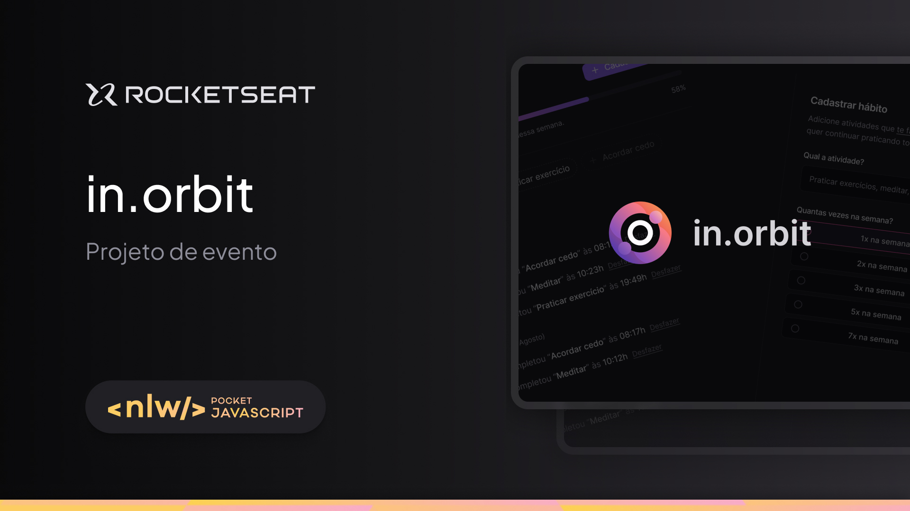

  

Aplicação desenvolvida no NLW Pocket da Rocketseat na trilha ReactJS e NodeJS.

 

  

## 🚀 Tecnologias

Esse projeto foi desenvolvido com as seguintes tecnologias:

- ReactJs
- TypeScript
- NodeJS
- TailwindCSS
- Drizzle
- Postgres

## Projeto

O projeto é um site desktop de registro de metas com progresso semanal.
